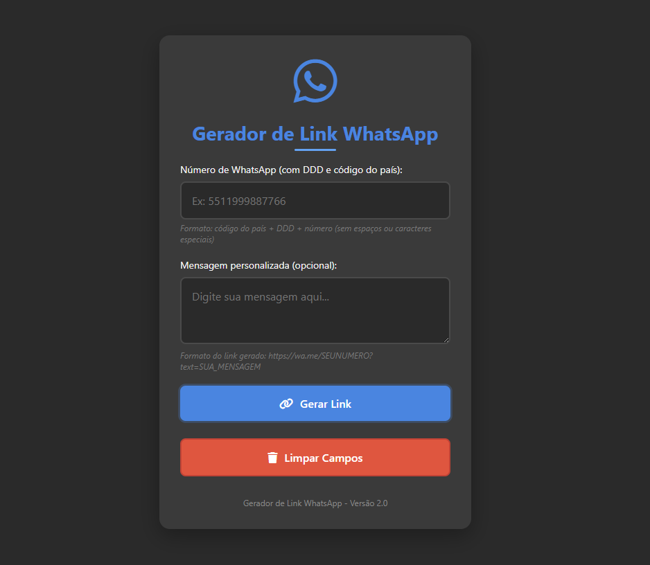

# Geralink WhatsApp

Um gerador de links para WhatsApp simples e eficiente, que permite criar links personalizados para iniciar conversas no WhatsApp sem precisar adicionar o contato.



## 🚀 Funcionalidades

- Geração de links para iniciar conversas no WhatsApp sem adicionar o contato
- Personalização de mensagens pré-definidas
- Interface amigável e responsiva
- Botão para copiar o link gerado
- Botão para abrir diretamente no WhatsApp
- Limpa campos automaticamente ao recarregar a página
- Validação de formato de número de telefone

## 📋 Pré-requisitos

- Navegador web moderno (Chrome, Firefox, Safari, Edge)
- Conexão com a internet para acessar a API do WhatsApp

## 🔧 Instalação

1. Faça download ou clone este repositório
   ```
   git clone https://github.com/luisfsill/Geralink-Whatsapp.git
   ```

2. Abra o arquivo `index.html` em seu navegador

3. Pronto para usar!

## 📖 Como usar

1. Digite o número de telefone incluindo o código do país e DDD (sem espaços ou caracteres especiais)
   - Exemplo: 5511999887766 (55 = Brasil, 11 = DDD, 999887766 = número)

2. Opcionalmente, digite uma mensagem personalizada que será enviada automaticamente

3. Clique no botão "Gerar Link"

4. Use o botão "Copiar Link" para copiar o link para a área de transferência ou "Abrir no WhatsApp" para iniciar a conversa diretamente

## 🔍 Formato do link

O link gerado segue o formato padrão da API do WhatsApp:
```
https://wa.me/NUMERODETELEFONE?text=MENSAGEM
```

Onde:
- `NUMERODETELEFONE` é o número completo com código do país e DDD
- `MENSAGEM` é o texto codificado em formato URL (caracteres especiais e espaços são substituídos)

## 🛠️ Construído com

- HTML5
- CSS3
- JavaScript
- [Font Awesome](https://fontawesome.com/) - Para ícones
- API WhatsApp

## ✒️ Autor

* **Luis Felipe** - *Desenvolvimento* - [Luis Felipe](https://github.com/luisfsill)

## 📄 Licença

Este projeto está sob a licença [MIT](LICENSE)

## 🎁 Expressões de gratidão

* Compartilhe este projeto com outras pessoas 📢
* Convide alguém da equipe para uma cerveja 🍺 
* Um agradecimento publicamente 🤓 
